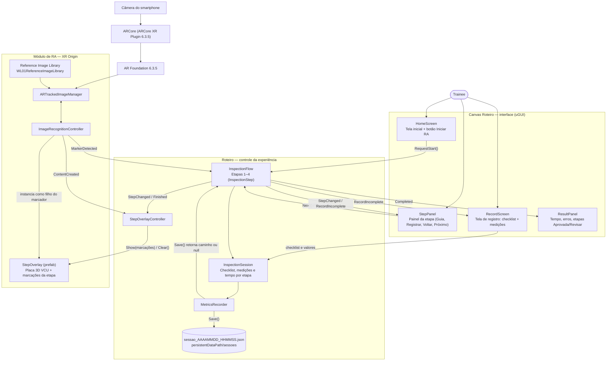

# Arquitetura do Sistema

Visão das camadas do B'Energy AR Academy (interface, roteiro, dados e módulo de RA) e de como elas se comunicam na cena única `WL01RecognitionAR`.

```mermaid
flowchart TB
    USER(["Trainee"])

    subgraph UI["Canvas Roteiro — interface (uGUI)"]
        HOME["HomeScreen<br/>Tela inicial + botão Iniciar RA"]
        PANEL["StepPanel<br/>Painel da etapa (Guia, Registrar, Voltar, Próximo)"]
        RECORD["RecordScreen<br/>Tela de registro: checklist + medições"]
        RESULT["ResultPanel<br/>Tempo, erros, etapas Aprovada/Revisar"]
    end

    subgraph ROTEIRO["Roteiro — controle da experiência"]
        FLOW["InspectionFlow<br/>Etapas 1–4 (InspectionStep)"]
        SESSION["InspectionSession<br/>Checklist, medições e tempo por etapa"]
        METRICS["MetricsRecorder"]
        JSON[("sessao_AAAAMMDD_HHMMSS.json<br/>persistentDataPath/sessoes")]
        OVCTRL["StepOverlayController"]
    end

    subgraph AR["Módulo de RA — XR Origin"]
        IRC["ImageRecognitionController"]
        TIM["ARTrackedImageManager"]
        LIB["Reference Image Library<br/>WL01ReferenceImageLibrary"]
        OVERLAY["StepOverlay (prefab)<br/>Placa 3D VCU + marcações da etapa"]
    end

    ARF["AR Foundation 6.3.5"]
    ARCORE["ARCore (ARCore XR Plugin 6.3.5)"]
    CAM["Câmera do smartphone"]

    USER --> HOME
    USER --> PANEL
    USER --> RECORD
    HOME -- "RequestStart()" --> FLOW
    PANEL -- "Next() / Previous()" --> FLOW
    RECORD -- "checklist e valores" --> SESSION
    FLOW -- "StepChanged / RecordIncomplete" --> PANEL
    FLOW -- "RecordIncomplete" --> RECORD
    FLOW -- "Completed" --> RESULT
    FLOW --> SESSION
    SESSION --> METRICS
    METRICS -- "Save()" --> JSON
    METRICS -- "Save() retorna caminho ou null" --> FLOW

    CAM --> ARCORE
    ARCORE --> ARF
    ARF --> TIM
    LIB --> TIM
    TIM <--> IRC
    IRC -- "MarkerDetected" --> FLOW
    IRC -- "ContentCreated" --> OVCTRL
    IRC -- "instancia como filho do marcador" --> OVERLAY
    FLOW -- "StepChanged / Finished" --> OVCTRL
    OVCTRL -- "Show(marcações) / Clear()" --> OVERLAY
```
