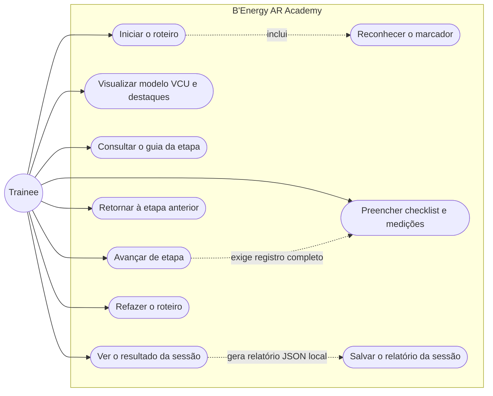

# Caso de Uso

Ações do trainee na versão atual do B'Energy AR Academy.

```mermaid
flowchart LR
    T((Trainee))
    subgraph APP["B'Energy AR Academy"]
        U1([Iniciar o roteiro])
        U2([Reconhecer o marcador])
        U3([Visualizar modelo VCU e destaques])
        U4([Consultar o guia da etapa])
        U5([Preencher checklist e medições])
        U6([Avançar de etapa])
        U7([Retornar à etapa anterior])
        U8([Ver o resultado da sessão])
        U9([Refazer o roteiro])
        U10([Salvar o relatório da sessão])
    end
    T --> U1
    T --> U3
    T --> U4
    T --> U5
    T --> U6
    T --> U7
    T --> U8
    T --> U9
    U1 -. inclui .-> U2
    U6 -. exige registro completo .-> U5
    U8 -. gera relatório JSON local .-> U10
```
