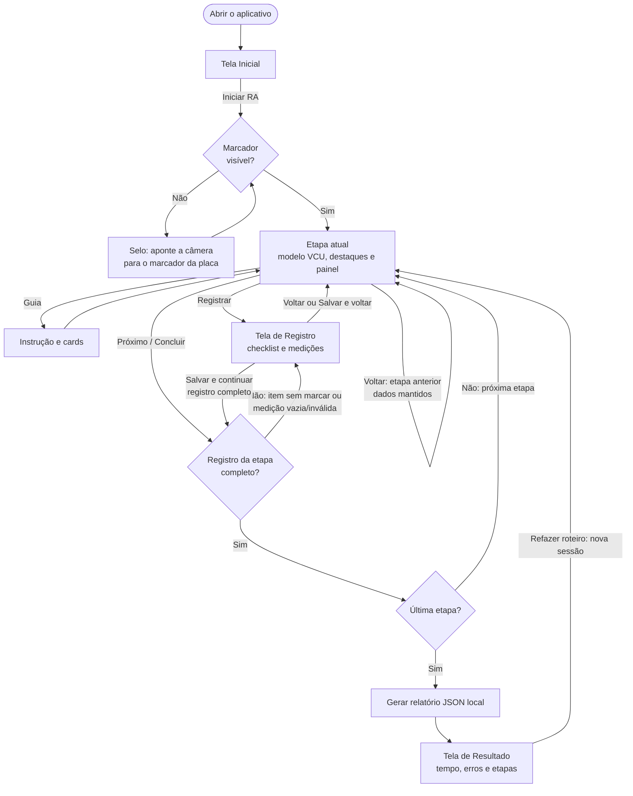

# Fluxo de Funcionamento

Fluxo atual do aplicativo, conforme `InspectionFlow`: início, etapas, registro obrigatório, resultado e reinício.

```mermaid
flowchart TD
    A([Abrir o aplicativo]) --> B[Tela Inicial]
    B -->|Iniciar RA| C{Marcador<br/>visível?}
    C -->|Não| D[Selo: aponte a câmera<br/>para o marcador da placa]
    D --> C
    C -->|Sim| E[Etapa atual<br/>modelo VCU, destaques e painel]
    E -->|Guia| F[Instrução e cards]
    F --> E
    E -->|Registrar| G[Tela de Registro<br/>checklist e medições]
    E -->|Voltar: etapa anterior<br/>dados mantidos| E
    E -->|Próximo / Concluir| H{Registro da etapa<br/>completo?}
    H -->|Não: item sem marcar ou<br/>medição vazia/inválida| G
    G -->|Voltar ou Salvar e voltar| E
    G -->|Salvar e continuar<br/>registro completo| H
    H -->|Sim| I{Última etapa?}
    I -->|Não: próxima etapa| E
    I -->|Sim| J[Gerar relatório JSON local]
    J --> K[Tela de Resultado<br/>tempo, erros e etapas]
    K -->|Refazer roteiro: nova sessão| E
```
