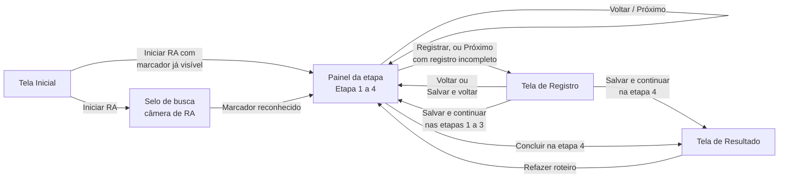

# Fluxo de Navegação

Navegação entre as telas da cena `WL01RecognitionAR`.

```mermaid
flowchart LR
    A[Tela Inicial] -->|Iniciar RA| B[Selo de busca<br/>câmera de RA]
    A -->|Iniciar RA com<br/>marcador já visível| C
    B -->|Marcador reconhecido| C[Painel da etapa<br/>Etapa 1 a 4]
    C -->|Voltar / Próximo| C
    C -->|Registrar, ou Próximo<br/>com registro incompleto| D[Tela de Registro]
    D -->|Voltar ou<br/>Salvar e voltar| C
    D -->|Salvar e continuar<br/>nas etapas 1 a 3| C
    D -->|Salvar e continuar<br/>na etapa 4| E[Tela de Resultado]
    C -->|Concluir na etapa 4| E
    E -->|Refazer roteiro| C
```
