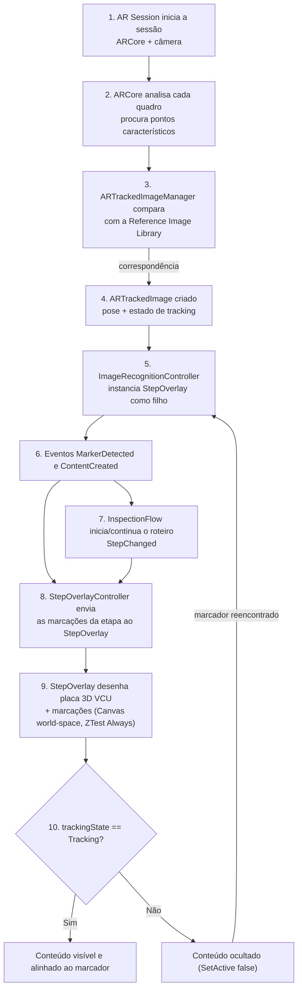

# Fluxo técnico da Realidade Aumentada

Caminho do quadro da câmera até as marcações da etapa desenhadas sobre a placa, indicando qual componente executa cada passo.

```mermaid
flowchart TD
    A["1. AR Session inicia a sessão<br/>ARCore + câmera"] --> B["2. ARCore analisa cada quadro<br/>procura pontos característicos"]
    B --> C["3. ARTrackedImageManager compara<br/>com a Reference Image Library"]
    C -->|correspondência| D["4. ARTrackedImage criado<br/>pose + estado de tracking"]
    D --> E["5. ImageRecognitionController<br/>instancia StepOverlay como filho"]
    E --> F["6. Eventos MarkerDetected e ContentCreated"]
    F --> G["7. InspectionFlow inicia/continua o roteiro<br/>StepChanged"]
    F --> H["8. StepOverlayController envia<br/>as marcações da etapa ao StepOverlay"]
    G --> H
    H --> I["9. StepOverlay desenha placa 3D VCU<br/>+ marcações (Canvas world-space, ZTest Always)"]
    I --> J{"10. trackingState == Tracking?"}
    J -->|Sim| K["Conteúdo visível e alinhado ao marcador"]
    J -->|Não| L["Conteúdo ocultado (SetActive false)"]
    L -->|marcador reencontrado| E
```
